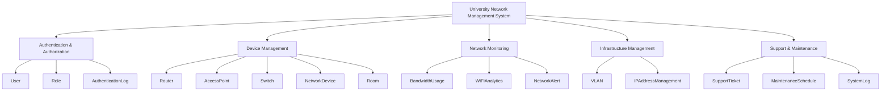
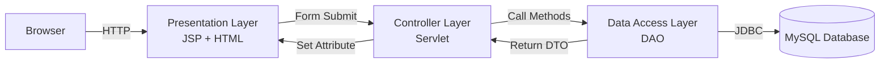
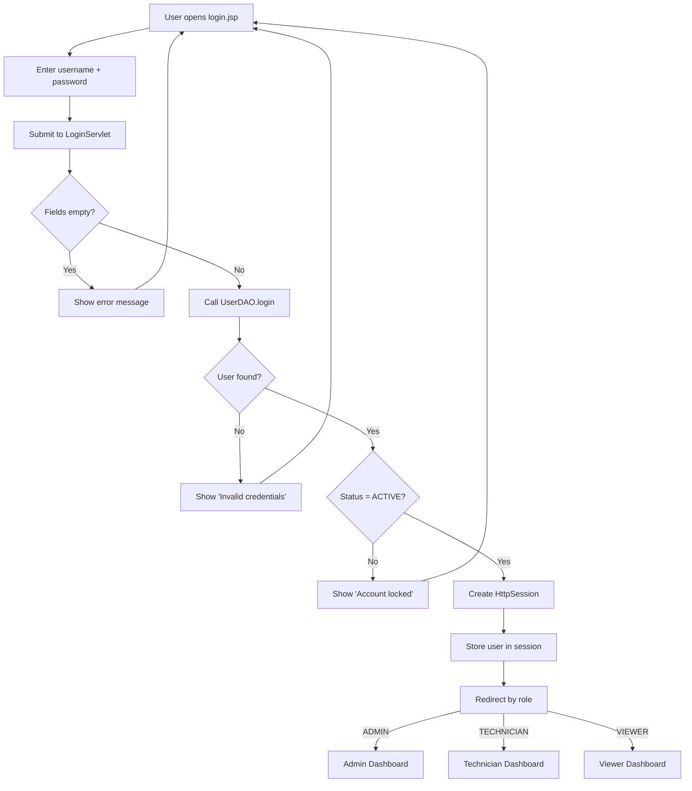
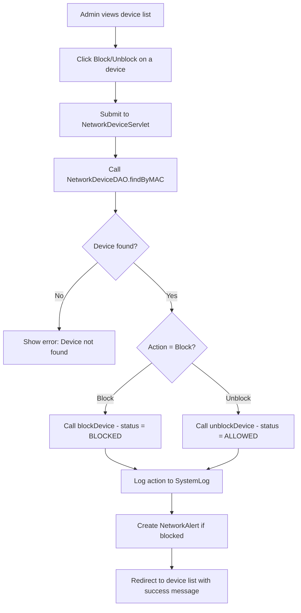
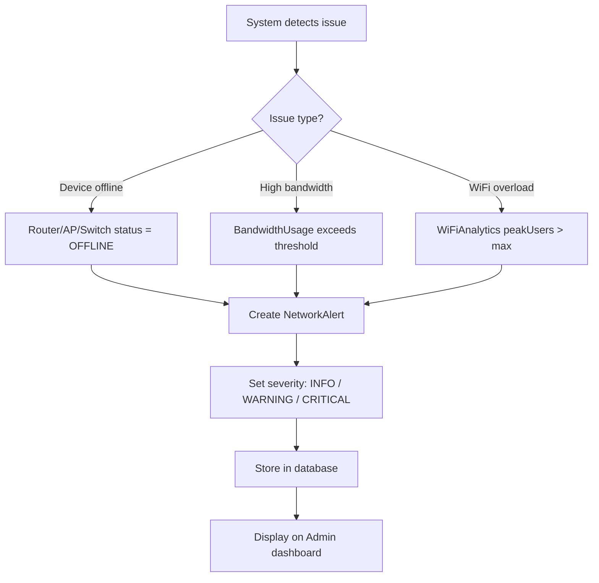
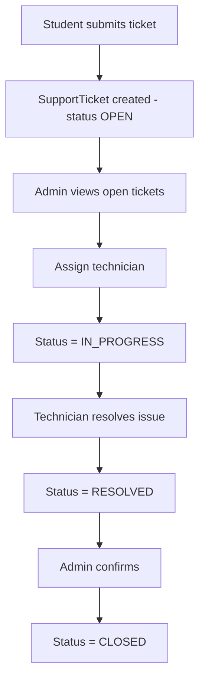

# Computational Thinking Analysis

This document applies the **4 pillars of Computational Thinking** to the University Network Management System.

---

## 1. Decomposition — Breaking the System into Parts

We decompose the system into **5 major subsystems**, each containing related models:

### 1.1 Authentication & Authorization

| Model | Purpose |
|---|---|
| **User** | Login, account management, role assignment |
| **Role** | Define access levels: Admin, Technician, Viewer |
| **AuthenticationLog** | Track all login attempts (success/failure) |

### 1.2 Device Management

| Model | Purpose |
|---|---|
| **Router** | Campus routers — name, IP, firmware, online/offline |
| **AccessPoint** | WiFi APs — SSID, connected users, signal |
| **Switch** | Network switches — ports, usage |
| **NetworkDevice** | Student/lecturer devices — MAC, owner, block/unblock |
| **Room** | Physical classrooms with network infrastructure |

### 1.3 Network Monitoring & Analytics

| Model | Purpose |
|---|---|
| **BandwidthUsage** | Track upload/download speed per device |
| **WiFiAnalytics** | Aggregate WiFi usage — total users, peak, avg speed |
| **NetworkAlert** | Auto-generated alerts on outages or anomalies |

### 1.4 Infrastructure Management

| Model | Purpose |
|---|---|
| **VLAN** | Campus VLAN definitions and subnets |
| **IPAddressManagement** | IP allocation and availability tracking |

### 1.5 Support & Maintenance

| Model | Purpose |
|---|---|
| **SupportTicket** | Student-submitted WiFi issue reports |
| **MaintenanceSchedule** | Planned maintenance windows |
| **SystemLog** | Full audit trail of all system actions |

### Decomposition Diagram



---

## 2. Pattern Recognition — Identifying Repeating Structures

### 2.1 CRUD Pattern

Almost every model follows the same Create-Read-Update-Delete pattern:

```text
insert()  →  INSERT INTO table ...
findAll() →  SELECT * FROM table
findById()→  SELECT * FROM table WHERE id = ?
update()  →  UPDATE table SET ...
delete()  →  DELETE FROM table WHERE id = ?
```

Models that follow this exact pattern: User, Role, Router, AccessPoint, Switch, NetworkDevice, Room, VLAN, MaintenanceSchedule, NetworkAlert, SupportTicket, SystemLog.

### 2.2 Status Management Pattern

Many models use a `status` field with a fixed set of values:

| Model | Status Values |
|---|---|
| User | `ACTIVE`, `INACTIVE`, `LOCKED` |
| Router | `ONLINE`, `OFFLINE`, `MAINTENANCE` |
| AccessPoint | `ONLINE`, `OFFLINE` |
| Switch | `ONLINE`, `OFFLINE` |
| NetworkDevice | `ALLOWED`, `BLOCKED` |
| SupportTicket | `OPEN`, `IN_PROGRESS`, `RESOLVED`, `CLOSED` |
| MaintenanceSchedule | `PLANNED`, `IN_PROGRESS`, `COMPLETED` |
| IPAddressManagement | `AVAILABLE`, `ASSIGNED`, `RESERVED` |

### 2.3 Role-Based Access Pattern

Every Servlet checks the user's role before processing:

```text
if (user.getRole().equals("ADMIN"))     → full access
if (user.getRole().equals("TECHNICIAN"))→ limited write access
if (user.getRole().equals("VIEWER"))    → read-only access
```

### 2.4 Date/Time Tracking Pattern

Most models include timestamp fields:

| Field | Used In |
|---|---|
| `createdAt` / `createdDate` | User, NetworkAlert, SupportTicket, SystemLog |
| `loginTime` | AuthenticationLog |
| `recordTime` | BandwidthUsage |
| `analyticsDate` | WiFiAnalytics |
| `startTime` / `endTime` | MaintenanceSchedule |

---

## 3. Abstraction — Defining Clean Layers

### 3.1 Three-Layer Architecture



### 3.2 DTO as Data Carrier

Each model is a **DTO (Data Transfer Object)** — a plain Java class that carries data between layers:

```text
┌─────────────────────────────────┐
│           Router DTO            │
├─────────────────────────────────┤
│ - routerId: int                 │
│ - routerName: String            │
│ - ipAddress: String             │
│ - macAddress: String            │
│ - model: String                 │
│ - firmware: String              │
│ - status: String                │
│ - location: String              │
├─────────────────────────────────┤
│ + getters / setters             │
└─────────────────────────────────┘
```

The DTO has **no database logic** — it only holds data. The DAO handles all SQL. The Servlet handles all HTTP. The JSP handles all HTML. This separation is the core abstraction.

### 3.3 Interface Abstraction

Each DAO can optionally implement a common interface:

```java
public interface BaseDAO<T> {
    boolean insert(T entity);
    boolean update(T entity);
    boolean delete(int id);
    T findById(int id);
    List<T> findAll();
}
```

This reduces code duplication and makes the system consistent.

---

## 4. Algorithm Design — Step-by-Step Logic

### 4.1 Login Flow



### 4.2 Device Block/Unblock Flow



### 4.3 Alert Trigger Flow



### 4.4 Support Ticket Lifecycle



---

## 5. CT Summary Table

| Pillar | How Applied |
|---|---|
| **Decomposition** | 16 models split into 5 subsystems, each assigned to team members |
| **Pattern Recognition** | CRUD pattern, status fields, role-based access, date tracking |
| **Abstraction** | 3-layer architecture, DTO as data carrier, BaseDAO interface |
| **Algorithm Design** | Flowcharts for login, device block, alert trigger, ticket lifecycle |

---

> [!note]
> This CT analysis should be referenced in **Chapter 2** of the final report. See [[06_report_template]] for the report structure.
