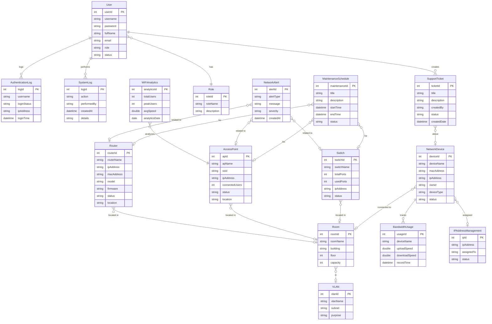

# ERD and Database Design — 16 Models

This document defines the full database schema for all 16 models in the University Network Management System.

> [!info]
> Database name: `network_simulation_db`. See [[PRJ301_Project_Setup_Guide|Project Setup Guide]] for connection details.

---

## 1. ERD Diagram (Mermaid)



---

## 2. SQL CREATE TABLE Statements

Run this script in MySQL Workbench, phpMyAdmin, or NetBeans database tools.

```sql
-- ============================================
-- University Network Management System
-- Database: network_simulation_db
-- ============================================

CREATE DATABASE IF NOT EXISTS network_simulation_db
CHARACTER SET utf8mb4
COLLATE utf8mb4_unicode_ci;

USE network_simulation_db;

-- =====================
-- 1. Role
-- =====================
CREATE TABLE Role (
    role_id INT AUTO_INCREMENT PRIMARY KEY,
    role_name VARCHAR(50) NOT NULL UNIQUE,
    description VARCHAR(255)
);

-- =====================
-- 2. User
-- =====================
CREATE TABLE User (
    user_id INT AUTO_INCREMENT PRIMARY KEY,
    username VARCHAR(50) NOT NULL UNIQUE,
    password VARCHAR(255) NOT NULL,
    full_name VARCHAR(100) NOT NULL,
    email VARCHAR(100),
    role VARCHAR(30) NOT NULL DEFAULT 'VIEWER',
    status VARCHAR(20) NOT NULL DEFAULT 'ACTIVE'
);

-- =====================
-- 3. Room
-- =====================
CREATE TABLE Room (
    room_id INT AUTO_INCREMENT PRIMARY KEY,
    room_name VARCHAR(100) NOT NULL,
    building VARCHAR(100),
    floor INT DEFAULT 1,
    capacity INT DEFAULT 0
);

-- =====================
-- 4. Router
-- =====================
CREATE TABLE Router (
    router_id INT AUTO_INCREMENT PRIMARY KEY,
    router_name VARCHAR(100) NOT NULL,
    ip_address VARCHAR(45),
    mac_address VARCHAR(50),
    model VARCHAR(100),
    firmware VARCHAR(100),
    status VARCHAR(30) NOT NULL DEFAULT 'ONLINE',
    location VARCHAR(150),
    room_id INT,
    CONSTRAINT fk_router_room FOREIGN KEY (room_id) REFERENCES Room(room_id)
);

-- =====================
-- 5. AccessPoint
-- =====================
CREATE TABLE AccessPoint (
    ap_id INT AUTO_INCREMENT PRIMARY KEY,
    ap_name VARCHAR(100) NOT NULL,
    ssid VARCHAR(100),
    ip_address VARCHAR(45),
    connected_users INT DEFAULT 0,
    status VARCHAR(30) NOT NULL DEFAULT 'ONLINE',
    location VARCHAR(150),
    room_id INT,
    CONSTRAINT fk_ap_room FOREIGN KEY (room_id) REFERENCES Room(room_id)
);

-- =====================
-- 6. Switch
-- =====================
CREATE TABLE Switch (
    switch_id INT AUTO_INCREMENT PRIMARY KEY,
    switch_name VARCHAR(100) NOT NULL,
    total_ports INT DEFAULT 0,
    used_ports INT DEFAULT 0,
    ip_address VARCHAR(45),
    status VARCHAR(30) NOT NULL DEFAULT 'ONLINE',
    room_id INT,
    CONSTRAINT fk_switch_room FOREIGN KEY (room_id) REFERENCES Room(room_id)
);

-- =====================
-- 7. NetworkDevice
-- =====================
CREATE TABLE NetworkDevice (
    device_id INT AUTO_INCREMENT PRIMARY KEY,
    device_name VARCHAR(100) NOT NULL,
    mac_address VARCHAR(50) UNIQUE,
    ip_address VARCHAR(45),
    owner VARCHAR(100),
    device_type VARCHAR(50),
    status VARCHAR(30) NOT NULL DEFAULT 'ALLOWED',
    room_id INT,
    CONSTRAINT fk_device_room FOREIGN KEY (room_id) REFERENCES Room(room_id)
);

-- =====================
-- 8. VLAN
-- =====================
CREATE TABLE VLAN (
    vlan_id INT AUTO_INCREMENT PRIMARY KEY,
    vlan_name VARCHAR(100) NOT NULL,
    subnet VARCHAR(50),
    purpose VARCHAR(255),
    room_id INT,
    CONSTRAINT fk_vlan_room FOREIGN KEY (room_id) REFERENCES Room(room_id)
);

-- =====================
-- 9. IPAddressManagement
-- =====================
CREATE TABLE IPAddressManagement (
    ip_id INT AUTO_INCREMENT PRIMARY KEY,
    ip_address VARCHAR(45) NOT NULL UNIQUE,
    assigned_to VARCHAR(100),
    status VARCHAR(30) NOT NULL DEFAULT 'AVAILABLE'
);

-- =====================
-- 10. BandwidthUsage
-- =====================
CREATE TABLE BandwidthUsage (
    usage_id INT AUTO_INCREMENT PRIMARY KEY,
    device_name VARCHAR(100),
    upload_speed DOUBLE DEFAULT 0,
    download_speed DOUBLE DEFAULT 0,
    record_time DATETIME NOT NULL DEFAULT CURRENT_TIMESTAMP
);

-- =====================
-- 11. WiFiAnalytics
-- =====================
CREATE TABLE WiFiAnalytics (
    analytics_id INT AUTO_INCREMENT PRIMARY KEY,
    total_users INT DEFAULT 0,
    peak_users INT DEFAULT 0,
    avg_speed DOUBLE DEFAULT 0,
    analytics_date DATE NOT NULL
);

-- =====================
-- 12. NetworkAlert
-- =====================
CREATE TABLE NetworkAlert (
    alert_id INT AUTO_INCREMENT PRIMARY KEY,
    alert_type VARCHAR(50),
    message VARCHAR(255) NOT NULL,
    severity VARCHAR(20) NOT NULL DEFAULT 'INFO',
    created_at DATETIME NOT NULL DEFAULT CURRENT_TIMESTAMP
);

-- =====================
-- 13. SupportTicket
-- =====================
CREATE TABLE SupportTicket (
    ticket_id INT AUTO_INCREMENT PRIMARY KEY,
    title VARCHAR(150) NOT NULL,
    description TEXT,
    created_by VARCHAR(100),
    status VARCHAR(30) NOT NULL DEFAULT 'OPEN',
    created_date DATETIME NOT NULL DEFAULT CURRENT_TIMESTAMP
);

-- =====================
-- 14. MaintenanceSchedule
-- =====================
CREATE TABLE MaintenanceSchedule (
    maintenance_id INT AUTO_INCREMENT PRIMARY KEY,
    title VARCHAR(150) NOT NULL,
    description TEXT,
    start_time DATETIME NOT NULL,
    end_time DATETIME,
    status VARCHAR(30) NOT NULL DEFAULT 'PLANNED'
);

-- =====================
-- 15. AuthenticationLog
-- =====================
CREATE TABLE AuthenticationLog (
    log_id INT AUTO_INCREMENT PRIMARY KEY,
    username VARCHAR(50),
    login_status VARCHAR(20) NOT NULL,
    ip_address VARCHAR(45),
    login_time DATETIME NOT NULL DEFAULT CURRENT_TIMESTAMP
);

-- =====================
-- 16. SystemLog
-- =====================
CREATE TABLE SystemLog (
    log_id INT AUTO_INCREMENT PRIMARY KEY,
    action VARCHAR(100) NOT NULL,
    performed_by VARCHAR(100),
    created_at DATETIME NOT NULL DEFAULT CURRENT_TIMESTAMP,
    details TEXT
);
```

---

## 3. Sample Data

```sql
USE network_simulation_db;

-- Roles
INSERT INTO Role (role_name, description) VALUES
('Admin', 'Full system access'),
('Technician', 'Device maintenance and support'),
('Viewer', 'Read-only dashboard access');

-- Users
INSERT INTO User (username, password, fullName, email, role, status) VALUES
('admin', 'admin123', 'System Administrator', 'admin@university.edu', 'Admin', 'ACTIVE'),
('tech01', 'tech123', 'Nguyen Van A', 'nva@university.edu', 'Technician', 'ACTIVE'),
('viewer01', 'view123', 'Tran Thi B', 'ttb@university.edu', 'Viewer', 'ACTIVE');

-- Rooms
INSERT INTO Room (room_name, building, floor, capacity) VALUES
('A101', 'Building A', 1, 40),
('A201', 'Building A', 2, 35),
('B101', 'Building B', 1, 50);

-- Routers
INSERT INTO Router (router_name, ip_address, mac_address, model, firmware, status, location, room_id) VALUES
('Core Router', '192.168.1.1', 'AA:BB:CC:DD:EE:01', 'Cisco 2901', '15.7', 'ONLINE', 'Server Room', NULL),
('Building A Router', '192.168.2.1', 'AA:BB:CC:DD:EE:02', 'MikroTik RB750', '6.48', 'ONLINE', 'Building A', NULL);

-- Access Points
INSERT INTO AccessPoint (ap_name, ssid, ip_address, connected_users, status, location, room_id) VALUES
('AP-Floor1', 'UniWiFi-F1', '192.168.2.10', 25, 'ONLINE', 'Building A Floor 1', 1),
('AP-Floor2', 'UniWiFi-F2', '192.168.2.11', 18, 'ONLINE', 'Building A Floor 2', 2);

-- Switches
INSERT INTO Switch (switch_name, total_ports, used_ports, ip_address, status, room_id) VALUES
('Switch-A1', 48, 32, '192.168.2.2', 'ONLINE', 1),
('Switch-B1', 24, 10, '192.168.3.2', 'ONLINE', 3);

-- Network Devices
INSERT INTO NetworkDevice (device_name, mac_address, ip_address, owner, device_type, status, room_id) VALUES
('Laptop-NVA', '11:22:33:44:55:01', '192.168.2.100', 'Nguyen Van A', 'Laptop', 'ALLOWED', 1),
('Phone-TTB', '11:22:33:44:55:02', '192.168.2.101', 'Tran Thi B', 'Smartphone', 'ALLOWED', 2);

-- VLANs
INSERT INTO VLAN (vlan_name, subnet, purpose, room_id) VALUES
('VLAN-Staff', '192.168.2.0/24', 'Staff network', NULL),
('VLAN-Student', '192.168.3.0/24', 'Student network', NULL);

-- IP Address Management
INSERT INTO IPAddressManagement (ip_address, assigned_to, status) VALUES
('192.168.2.100', 'Laptop-NVA', 'ASSIGNED'),
('192.168.2.101', 'Phone-TTB', 'ASSIGNED'),
('192.168.2.102', NULL, 'AVAILABLE');

-- Bandwidth Usage
INSERT INTO BandwidthUsage (device_name, upload_speed, download_speed, record_time) VALUES
('Laptop-NVA', 45.5, 120.3, NOW()),
('Phone-TTB', 12.1, 55.8, NOW());

-- WiFi Analytics
INSERT INTO WiFiAnalytics (total_users, peak_users, avg_speed, analytics_date) VALUES
(43, 60, 85.5, CURDATE());

-- Network Alerts
INSERT INTO NetworkAlert (alert_type, message, severity, created_at) VALUES
('OUTAGE', 'AP-Floor2 went offline', 'CRITICAL', NOW()),
('PERFORMANCE', 'High bandwidth usage on Switch-A1', 'WARNING', NOW());

-- Support Tickets
INSERT INTO SupportTicket (title, description, created_by, status) VALUES
('WiFi slow in A101', 'Students report very slow WiFi during class hours', 'viewer01', 'OPEN'),
('Cannot connect to Eduroam', 'Authentication fails for eduroam SSID', 'viewer01', 'OPEN');

-- Maintenance Schedule
INSERT INTO MaintenanceSchedule (title, description, start_time, end_time, status) VALUES
('Router firmware upgrade', 'Upgrade Building A Router to v6.49', '2026-06-01 22:00:00', '2026-06-02 02:00:00', 'PLANNED');

-- Authentication Log
INSERT INTO AuthenticationLog (username, login_status, ip_address, login_time) VALUES
('admin', 'SUCCESS', '192.168.1.100', NOW()),
('tech01', 'SUCCESS', '192.168.2.50', NOW()),
('hacker', 'FAILED', '10.0.0.1', NOW());

-- System Log
INSERT INTO SystemLog (action, performed_by, created_at, details) VALUES
('LOGIN', 'admin', NOW(), 'Admin logged in from 192.168.1.100'),
('UPDATE_DEVICE', 'tech01', NOW(), 'Updated AP-Floor1 status to ONLINE');
```

---

## 4. Relationship Explanations

| Relationship | Type | Description |
|---|---|---|
| User → Role | Many-to-One | Each user has one role (stored as string for simplicity) |
| Router → Room | Many-to-One | A router is located in one room |
| AccessPoint → Room | Many-to-One | An AP serves one room/area |
| Switch → Room | Many-to-One | A switch is installed in one room |
| NetworkDevice → Room | Many-to-One | A device is connected in one room |
| VLAN → Room | Many-to-One | A VLAN can serve a room |
| NetworkDevice → BandwidthUsage | One-to-Many | A device has many bandwidth records |
| NetworkDevice → IPAddressManagement | One-to-One | A device is assigned one IP |

> [!note]
> Some foreign keys are optional (nullable) because not every device is in a room, and not every alert is tied to a specific device.

---

## 5. Indexing Strategy

| Table | Index | Reason |
|---|---|---|
| User | `username` (UNIQUE) | Fast login lookup |
| NetworkDevice | `mac_address` (UNIQUE) | Fast MAC-based device search |
| IPAddressManagement | `ip_address` (UNIQUE) | Prevent duplicate IP assignment |
| BandwidthUsage | `record_time` | Fast date-range queries |
| AuthenticationLog | `login_time`, `username` | Fast log search |
| SystemLog | `created_at`, `performed_by` | Fast audit trail search |
| NetworkAlert | `created_at`, `severity` | Fast alert filtering |

---

## 6. Related Documents

- [[00_project_overview]] — Project overview
- [[03_team_assignment]] — Who owns which tables
- [[07_coding_guide]] — How to implement DAO for these tables
