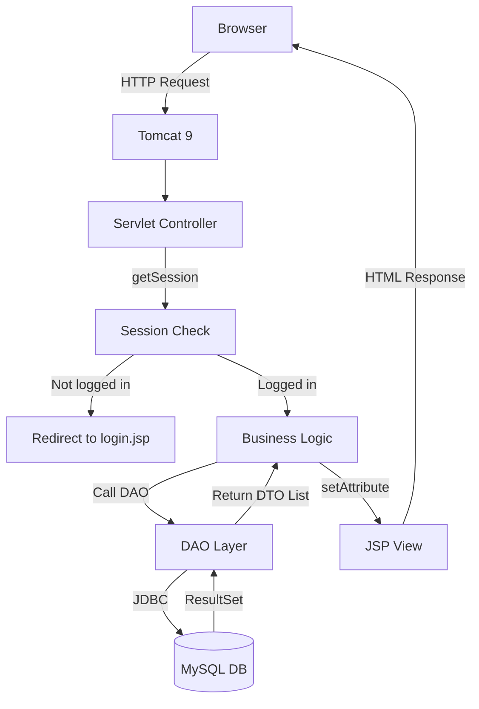
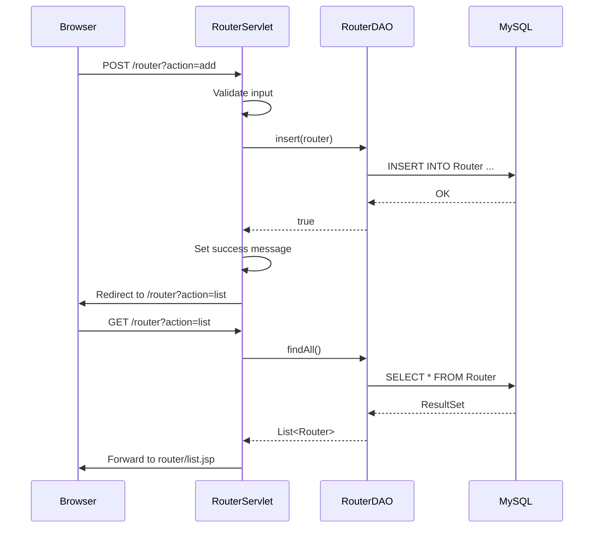

# System Architecture and Folder Structure

## 1. Architecture Overview

The system follows a classic **MVC (Model-View-Controller)** pattern using Java Servlet/JSP.



### Layer Responsibilities

| Layer | Technology | Responsibility |
|---|---|---|
| **Presentation** | JSP + JSTL + CSS | Render HTML, accept form input |
| **Controller** | Servlet (`javax.servlet`) | Handle HTTP requests, validate input, route to JSP |
| **Data Access** | DAO classes | SQL queries via JDBC |
| **Model** | DTO (JavaBean) | Data carrier between layers |
| **Utility** | Helper classes | DB connection, session management |

---

## 2. Project Folder Structure

This is the recommended structure for the NetBeans Ant project `NetworkSimulationManagement`:

```text
NetworkSimulationManagement/
├── Web Pages/
│   ├── index.jsp
│   ├── login.jsp
│   ├── dashboard.jsp
│   ├── error.jsp
│   ├── WEB-INF/
│   │   └── web.xml
│   ├── assets/
│   │   ├── css/
│   │   │   └── style.css
│   │   ├── js/
│   │   │   └── main.js
│   │   └── images/
│   │       └── logo.png
│   ├── user/
│   │   ├── list.jsp
│   │   └── form.jsp
│   ├── role/
│   │   └── list.jsp
│   ├── router/
│   │   ├── list.jsp
│   │   └── form.jsp
│   ├── accesspoint/
│   │   ├── list.jsp
│   │   └── form.jsp
│   ├── switch/
│   │   ├── list.jsp
│   │   └── form.jsp
│   ├── device/
│   │   ├── list.jsp
│   │   └── form.jsp
│   ├── room/
│   │   ├── list.jsp
│   │   └── form.jsp
│   ├── vlan/
│   │   ├── list.jsp
│   │   └── form.jsp
│   ├── ip/
│   │   └── list.jsp
│   ├── bandwidth/
│   │   ├── list.jsp
│   │   └── form.jsp
│   ├── analytics/
│   │   └── dashboard.jsp
│   ├── alert/
│   │   └── list.jsp
│   ├── ticket/
│   │   ├── list.jsp
│   │   └── form.jsp
│   ├── maintenance/
│   │   ├── list.jsp
│   │   └── form.jsp
│   ├── authlog/
│   │   └── list.jsp
│   └── systemlog/
│       └── list.jsp
├── Source Packages/
│   └── com.networksim/
│       ├── controller/
│       │   ├── LoginServlet.java
│       │   ├── UserServlet.java
│       │   ├── RoleServlet.java
│       │   ├── RouterServlet.java
│       │   ├── AccessPointServlet.java
│       │   ├── SwitchServlet.java
│       │   ├── NetworkDeviceServlet.java
│       │   ├── RoomServlet.java
│       │   ├── VLANServlet.java
│       │   ├── IPServlet.java
│       │   ├── BandwidthServlet.java
│       │   ├── WiFiAnalyticsServlet.java
│       │   ├── AlertServlet.java
│       │   ├── TicketServlet.java
│       │   ├── MaintenanceServlet.java
│       │   └── DashboardServlet.java
│       ├── dao/
│       │   ├── UserDAO.java
│       │   ├── RoleDAO.java
│       │   ├── RouterDAO.java
│       │   ├── AccessPointDAO.java
│       │   ├── SwitchDAO.java
│       │   ├── NetworkDeviceDAO.java
│       │   ├── RoomDAO.java
│       │   ├── VLANDAO.java
│       │   ├── IPAddressDAO.java
│       │   ├── BandwidthUsageDAO.java
│       │   ├── WiFiAnalyticsDAO.java
│       │   ├── NetworkAlertDAO.java
│       │   ├── SupportTicketDAO.java
│       │   ├── MaintenanceDAO.java
│       │   ├── AuthLogDAO.java
│       │   └── SystemLogDAO.java
│       ├── model/
│       │   ├── User.java
│       │   ├── Role.java
│       │   ├── Router.java
│       │   ├── AccessPoint.java
│       │   ├── Switch.java
│       │   ├── NetworkDevice.java
│       │   ├── Room.java
│       │   ├── VLAN.java
│       │   ├── IPAddressManagement.java
│       │   ├── BandwidthUsage.java
│       │   ├── WiFiAnalytics.java
│       │   ├── NetworkAlert.java
│       │   ├── SupportTicket.java
│       │   ├── MaintenanceSchedule.java
│       │   ├── AuthenticationLog.java
│       │   └── SystemLog.java
│       └── util/
│           ├── DBContext.java
│           └── SessionUtil.java
├── Libraries/
│   ├── mysql-connector-java-8.0.33.jar
│   └── jstl-1.2.jar
└── build.xml
```

---

## 3. Naming Conventions

### 3.1 Java Classes

| Type | Convention | Example |
|---|---|---|
| DTO/Model | PascalCase, singular | `Router.java`, `BandwidthUsage.java` |
| DAO | PascalCase + DAO suffix | `RouterDAO.java`, `BandwidthUsageDAO.java` |
| Servlet | PascalCase + Servlet suffix | `RouterServlet.java`, `LoginServlet.java` |
| Utility | PascalCase | `DBContext.java`, `SessionUtil.java` |

### 3.2 Methods

| Type | Convention | Example |
|---|---|---|
| Get all | `findAll()` | `routerDAO.findAll()` |
| Get by ID | `findById(int id)` | `routerDAO.findById(1)` |
| Create | `insert(entity)` | `routerDAO.insert(router)` |
| Update | `update(entity)` | `routerDAO.update(router)` |
| Delete | `delete(int id)` | `routerDAO.delete(1)` |
| Custom | descriptive verb | `findByMAC()`, `blockDevice()` |

### 3.3 JSP Files

| Type | Convention | Example |
|---|---|---|
| List page | `<entity>/list.jsp` | `router/list.jsp` |
| Form page | `<entity>/form.jsp` | `router/form.jsp` |
| Dashboard | `<feature>/dashboard.jsp` | `analytics/dashboard.jsp` |

### 3.4 Servlet URL Patterns

| Servlet | URL Pattern | Example |
|---|---|---|
| LoginServlet | `/login` | `http://localhost:8080/NetworkSimulationManagement/login` |
| RouterServlet | `/router` | `http://localhost:8080/NetworkSimulationManagement/router` |
| UserServlet | `/user` | `http://localhost:8080/NetworkSimulationManagement/user` |

### 3.5 Database

| Item | Convention | Example |
|---|---|---|
| Table name | PascalCase, singular | `Router`, `BandwidthUsage` |
| Primary key | `<entity>_id` | `router_id`, `usage_id` |
| Foreign key | referenced `<entity>_id` | `room_id` |
| Status values | UPPER_SNAKE_CASE | `ONLINE`, `IN_PROGRESS`, `ALLOWED` |

---

## 4. Shared Utilities

### 4.1 DBContext.java

Location: `com.networksim.util.DBContext`

```java
package com.networksim.util;

import java.sql.Connection;
import java.sql.DriverManager;
import java.sql.SQLException;

/**
 * Centralized database connection utility.
 * All DAO classes use this to get a Connection object.
 */
public class DBContext {

    private static final String URL = "jdbc:mysql://localhost:3306/network_simulation_db?useSSL=false&serverTimezone=UTC";
    private static final String USER = "root";
    private static final String PASSWORD = "your_password_here";

    public static Connection getConnection() throws ClassNotFoundException, SQLException {
        Class.forName("com.mysql.cj.jdbc.Driver");
        return DriverManager.getConnection(URL, USER, PASSWORD);
    }
}
```

> [!warning]
> Replace `your_password_here` with your actual MySQL password. Never commit real passwords to Git.

### 4.2 SessionUtil.java

Location: `com.networksim.util.SessionUtil`

```java
package com.networksim.util;

import com.networksim.model.User;
import javax.servlet.http.HttpServletRequest;
import javax.servlet.http.HttpSession;

/**
 * Helper for session management across all Servlets.
 */
public class SessionUtil {

    /**
     * Get the logged-in user from session.
     * Returns null if not logged in.
     */
    public static User getLoggedUser(HttpServletRequest request) {
        HttpSession session = request.getSession(false);
        if (session != null) {
            return (User) session.getAttribute("loggedUser");
        }
        return null;
    }

    /**
     * Check if user has one of the allowed roles.
     */
    public static boolean hasRole(HttpServletRequest request, String... roles) {
        User user = getLoggedUser(request);
        if (user == null) return false;
        for (String role : roles) {
            if (role.equals(user.getRole())) return true;
        }
        return false;
    }
}
```

### 4.3 web.xml

Location: `Web Pages/WEB-INF/web.xml`

```xml
<?xml version="1.0" encoding="UTF-8"?>
<web-app version="3.1"
         xmlns="http://xmlns.jcp.org/xml/ns/javaee"
         xmlns:xsi="http://www.w3.org/2001/XMLSchema-instance"
         xsi:schemaLocation="http://xmlns.jcp.org/xml/ns/javaee
         http://xmlns.jcp.org/xml/ns/javaee/web-app_3_1.xsd">

    <display-name>NetworkSimulationManagement</display-name>

    <welcome-file-list>
        <welcome-file>login.jsp</welcome-file>
    </welcome-file-list>

    <!-- Character encoding filter -->
    <filter>
        <filter-name>EncodingFilter</filter-name>
        <filter-class>com.networksim.filter.EncodingFilter</filter-class>
    </filter>
    <filter-mapping>
        <filter-name>EncodingFilter</filter-name>
        <url-pattern>/*</url-pattern>
    </filter-mapping>

</web-app>
```

---

## 5. Request Flow Example

Here's how a request flows through the system when a user adds a new router:



---

## 6. Error Handling Strategy

| Error Type | Handling |
|---|---|
| DB connection failure | Show `error.jsp` with message |
| SQL exception | Log to SystemLog, show user-friendly message |
| Not logged in | Redirect to `login.jsp` |
| Wrong role | Show "Access Denied" page |
| Form validation error | Re-show form with error messages |

---

## 7. Related Documents

- [[00_project_overview]] — Project overview and tech stack
- [[02_erd_database]] — Database schema
- [[03_team_assignment]] — Who builds what
- [[07_coding_guide]] — Step-by-step implementation guide
