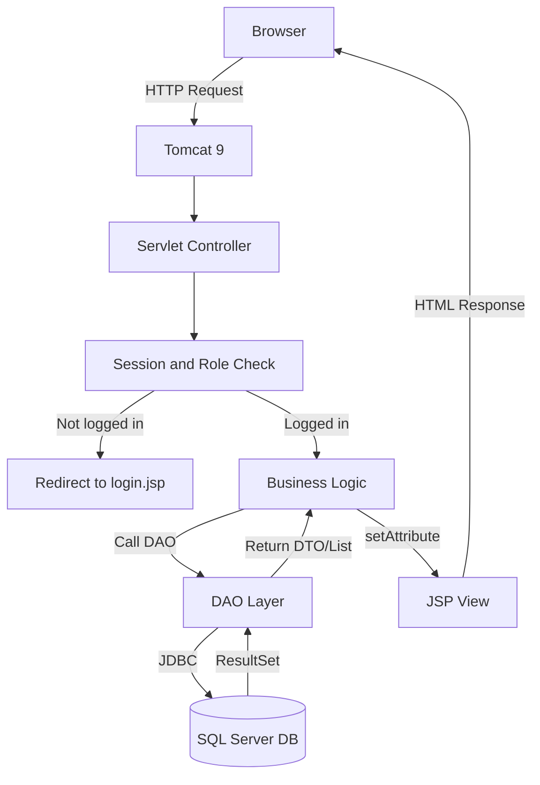
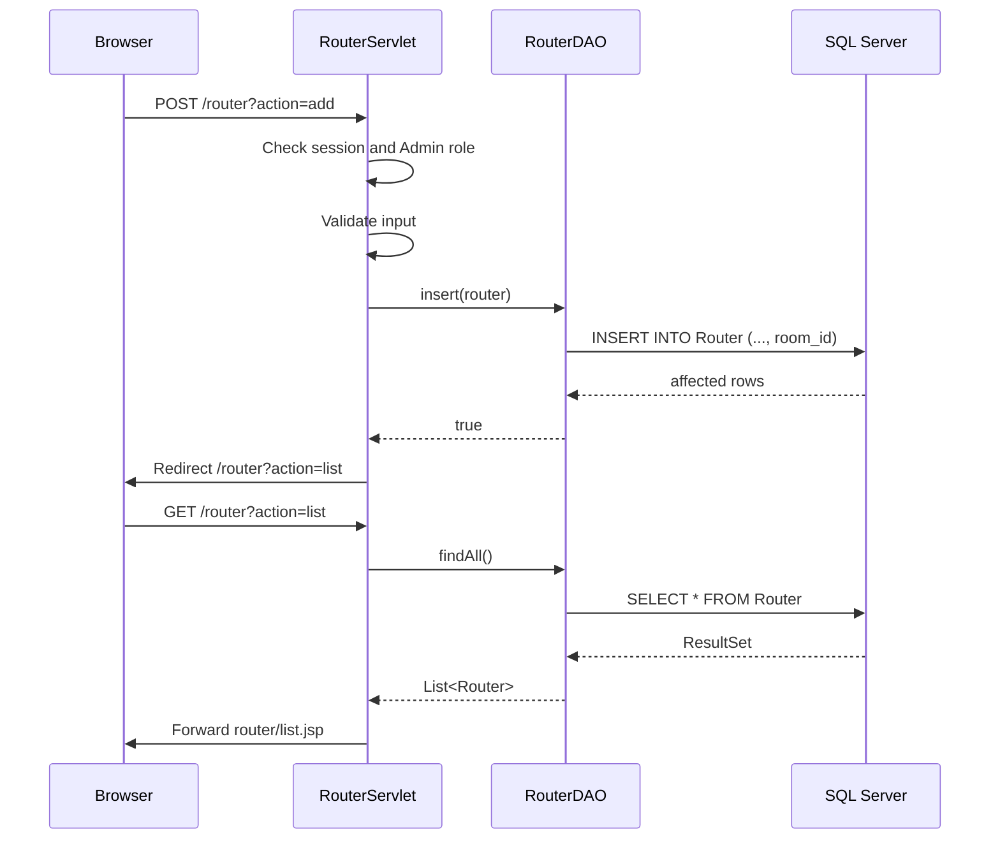

---
title: "System Architecture and Folder Structure"
tags: [prj301, planning, architecture, structure]
created: 2026-05-26
updated: 2026-06-07
---

# System Architecture and Folder Structure

## 1. Architecture Overview

The system follows the classic **MVC (Model-View-Controller)** pattern using Java Servlet/JSP, JDBC, and SQL Server.



### Layer Responsibilities

| Layer | Technology | Responsibility |
|---|---|---|
| Presentation | JSP + JSTL + CSS | Render HTML and receive form input |
| Controller | Servlet (`javax.servlet`) | Handle HTTP requests, validate input, check session/role, route to JSP |
| Data Access | DAO classes | SQL Server queries via JDBC |
| Model | DTO/JavaBean | Data carrier between layers |
| Utility | Helper classes | Database connection, session/role helper |

> This document is synchronized with `Network2.sql`. The current schema has **20 tables**: 16 main tables and 4 junction tables.

---

## 2. Project Folder Structure

Recommended NetBeans Ant project: `NetworkSimulationManagement`.

```text
NetworkSimulationManagement/
|-- Web Pages/
|   |-- index.jsp
|   |-- login.jsp
|   |-- dashboard.jsp
|   |-- error.jsp
|   |-- WEB-INF/
|   |   `-- web.xml
|   |-- assets/
|   |   |-- css/style.css
|   |   |-- js/main.js
|   |   `-- images/logo.png
|   |-- user/list.jsp
|   |-- user/form.jsp
|   |-- role/list.jsp
|   |-- role/form.jsp
|   |-- router/list.jsp
|   |-- router/form.jsp
|   |-- accesspoint/list.jsp
|   |-- accesspoint/form.jsp
|   |-- switch/list.jsp
|   |-- switch/form.jsp
|   |-- device/list.jsp
|   |-- device/form.jsp
|   |-- room/list.jsp
|   |-- room/form.jsp
|   |-- vlan/list.jsp
|   |-- vlan/form.jsp
|   |-- ip/list.jsp
|   |-- ticket/list.jsp
|   |-- ticket/form.jsp
|   |-- bandwidth/list.jsp
|   |-- bandwidth/form.jsp
|   |-- analytics/dashboard.jsp
|   |-- alert/list.jsp
|   |-- maintenance/list.jsp
|   |-- maintenance/form.jsp
|   |-- authlog/list.jsp
|   `-- systemlog/list.jsp
|-- Source Packages/
|   `-- com.networksim/
|       |-- controller/
|       |   |-- LoginServlet.java
|       |   |-- LogoutServlet.java
|       |   |-- DashboardServlet.java
|       |   |-- UserServlet.java
|       |   |-- RoleServlet.java
|       |   |-- RouterServlet.java
|       |   |-- AccessPointServlet.java
|       |   |-- SwitchServlet.java
|       |   |-- NetworkDeviceServlet.java
|       |   |-- RoomServlet.java
|       |   |-- VLANServlet.java
|       |   |-- IPServlet.java
|       |   |-- TicketServlet.java
|       |   |-- BandwidthServlet.java
|       |   |-- WiFiAnalyticsServlet.java
|       |   |-- AlertServlet.java
|       |   `-- MaintenanceServlet.java
|       |-- dao/
|       |   |-- UserDAO.java
|       |   |-- RoleDAO.java
|       |   |-- UserRoleDAO.java
|       |   |-- AuthenticationLogDAO.java
|       |   |-- SystemLogDAO.java
|       |   |-- RouterDAO.java
|       |   |-- AccessPointDAO.java
|       |   |-- SwitchDAO.java
|       |   |-- NetworkDeviceDAO.java
|       |   |-- RoomDAO.java
|       |   |-- VLANDAO.java
|       |   |-- IPAddressManagementDAO.java
|       |   |-- SupportTicketDAO.java
|       |   |-- BandwidthUsageDAO.java
|       |   |-- WiFiAnalyticsDAO.java
|       |   |-- NetworkAlertDAO.java
|       |   |-- MaintenanceScheduleDAO.java
|       |   |-- MaintenanceRouterDAO.java
|       |   |-- MaintenanceAccessPointDAO.java
|       |   `-- MaintenanceSwitchDAO.java
|       |-- model/
|       |   |-- User.java
|       |   |-- Role.java
|       |   |-- UserRole.java
|       |   |-- AuthenticationLog.java
|       |   |-- SystemLog.java
|       |   |-- Router.java
|       |   |-- AccessPoint.java
|       |   |-- Switch.java
|       |   |-- NetworkDevice.java
|       |   |-- Room.java
|       |   |-- VLAN.java
|       |   |-- IPAddressManagement.java
|       |   |-- SupportTicket.java
|       |   |-- BandwidthUsage.java
|       |   |-- WiFiAnalytics.java
|       |   |-- NetworkAlert.java
|       |   |-- MaintenanceSchedule.java
|       |   |-- MaintenanceRouter.java
|       |   |-- MaintenanceAccessPoint.java
|       |   `-- MaintenanceSwitch.java
|       |-- filter/
|       |   `-- EncodingFilter.java
|       `-- util/
|           |-- DBContext.java
|           `-- SessionUtil.java
|-- Libraries/
|   |-- mssql-jdbc-12.x.x.jre8.jar
|   `-- jstl-1.2.jar
`-- build.xml
```

> JSP naming convention: this architecture uses folder-based pages such as `router/list.jsp` and `router/form.jsp`. If the team prefers flat names like `router-list.jsp`, choose one style and update all servlet forwards consistently.

---

## 3. Naming Conventions

### 3.1 Java Classes

| Type | Convention | Example |
|---|---|---|
| DTO/Model | PascalCase, singular | `Router.java`, `UserRole.java` |
| DAO | PascalCase + DAO suffix | `RouterDAO.java`, `MaintenanceRouterDAO.java` |
| Servlet | PascalCase + Servlet suffix | `RouterServlet.java`, `LoginServlet.java` |
| Utility | PascalCase | `DBContext.java`, `SessionUtil.java` |

### 3.2 Java Fields vs Database Columns

| Database column | Java field |
|---|---|
| `router_id` | `routerId` |
| `room_id` | `roomId` |
| `created_at` | `createdAt` |
| `assigned_at` | `assignedAt` |

### 3.3 Database

| Item | Convention | Example |
|---|---|---|
| Table name | PascalCase, singular | `Router`, `BandwidthUsage` |
| Reserved table names | Wrap in brackets in SQL Server | `[User]`, `[Switch]` |
| Primary key | `<entity>_id` | `router_id`, `usage_id` |
| Foreign key | referenced `<entity>_id` | `room_id`, `device_id` |
| Status values | UPPER_SNAKE_CASE | `ONLINE`, `IN_PROGRESS`, `ALLOWED` |

---

## 4. Shared Utilities

### 4.1 DBContext.java

Location: `com.networksim.util.DBContext`

```java
package com.networksim.util;

import java.sql.Connection;
import java.sql.DriverManager;
import java.sql.SQLException;

public class DBContext {

    private static final String SERVER = "localhost";
    private static final String PORT = "1433";
    private static final String DATABASE = "network_simulation_db";
    private static final String USER = "sa";
    private static final String PASSWORD = "your_password_here";

    private static final String URL =
            "jdbc:sqlserver://" + SERVER + ":" + PORT
            + ";databaseName=" + DATABASE
            + ";encrypt=true;trustServerCertificate=true";

    public static Connection getConnection() throws ClassNotFoundException, SQLException {
        Class.forName("com.microsoft.sqlserver.jdbc.SQLServerDriver");
        return DriverManager.getConnection(URL, USER, PASSWORD);
    }
}
```

> `Network2.sql` currently creates `network_simulation_db3`. Before team integration, rename it to `network_simulation_db` or update `DBContext.DATABASE` consistently.

### 4.2 SessionUtil.java

The `User` table no longer has a direct `role` column. Roles are loaded from `UserRole`.

```java
package com.networksim.util;

import com.networksim.model.User;
import java.util.List;
import javax.servlet.http.HttpServletRequest;
import javax.servlet.http.HttpSession;

public class SessionUtil {

    public static User getLoggedUser(HttpServletRequest request) {
        HttpSession session = request.getSession(false);
        if (session == null) return null;
        return (User) session.getAttribute("loggedUser");
    }

    @SuppressWarnings("unchecked")
    public static List<String> getRoles(HttpServletRequest request) {
        HttpSession session = request.getSession(false);
        if (session == null) return java.util.Collections.emptyList();
        Object roles = session.getAttribute("roles");
        if (roles instanceof List) return (List<String>) roles;
        return java.util.Collections.emptyList();
    }

    public static boolean hasRole(HttpServletRequest request, String... allowedRoles) {
        List<String> userRoles = getRoles(request);
        for (String allowed : allowedRoles) {
            if (userRoles.contains(allowed)) return true;
        }
        return false;
    }
}
```

During login, `LoginServlet` should store:

```java
session.setAttribute("loggedUser", user);
session.setAttribute("roles", userRoleDAO.findRoleNamesByUser(user.getUserId()));
```

### 4.3 web.xml

Use `web.xml` for shared configuration such as welcome file and UTF-8 filter. Use `@WebServlet` for servlet mappings unless the team decides to manage all mappings in XML.

```xml
<?xml version="1.0" encoding="UTF-8"?>
<web-app version="3.1"
         xmlns="http://xmlns.jcp.org/xml/ns/javaee"
         xmlns:xsi="http://www.w3.org/2001/XMLSchema-instance"
         xsi:schemaLocation="http://xmlns.jcp.org/xml/ns/javaee
         http://xmlns.jcp.org/xml/ns/javaee/web-app_3_1.xsd">

    <display-name>NetworkSimulationManagement</display-name>

    <welcome-file-list>
        <welcome-file>login.jsp</welcome-file>
    </welcome-file-list>

    <filter>
        <filter-name>EncodingFilter</filter-name>
        <filter-class>com.networksim.filter.EncodingFilter</filter-class>
    </filter>
    <filter-mapping>
        <filter-name>EncodingFilter</filter-name>
        <url-pattern>/*</url-pattern>
    </filter-mapping>
</web-app>
```

---

## 5. Table Dependency Order

The SQL Server schema must be created in FK-safe order:

```text
Role
User
UserRole
Room
Router / AccessPoint / Switch / NetworkDevice
VLAN
IPAddressManagement
BandwidthUsage
WiFiAnalytics
NetworkAlert
SupportTicket
MaintenanceSchedule
MaintenanceRouter / MaintenanceAccessPoint / MaintenanceSwitch
AuthenticationLog
SystemLog
```

For coding dependencies, `Room` should be implemented early because many device and infrastructure tables use `room_id`.

---

## 6. Request Flow Example



---

## 7. Error Handling Strategy

| Error Type | Handling |
|---|---|
| DB connection failure | Show `error.jsp` with friendly message |
| SQL exception | Log to `SystemLog` when a logged-in user exists |
| Not logged in | Redirect to `login.jsp` |
| Wrong role | Show access denied message or redirect with `msg=access_denied` |
| Form validation error | Re-show form with error messages |
| FK delete conflict | Do not delete blindly; show message explaining related records exist |

---

## 8. Related Documents

- `Network2.sql` - Current SQL Server schema and sample data
- `03_team_assignment_updated.md` - Current table ownership and sprint plan
- `05_feature_list.md` - Feature list by role
- `07_coding_guide.md` - Implementation guide

