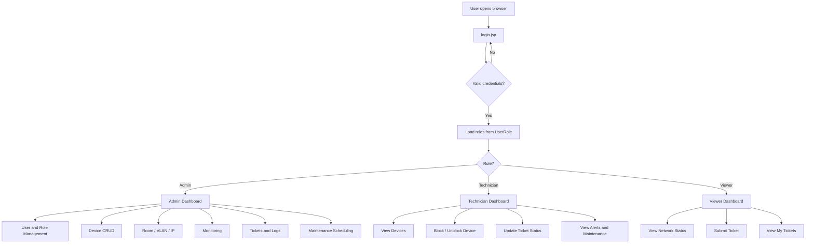
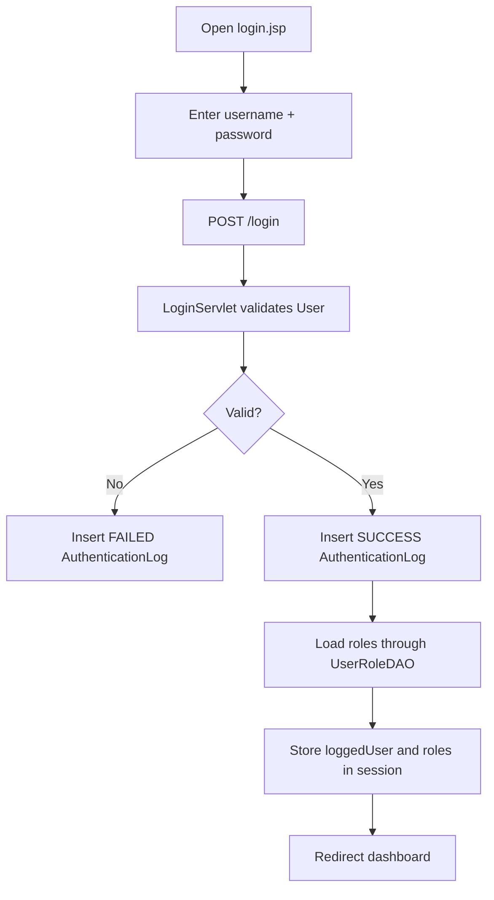
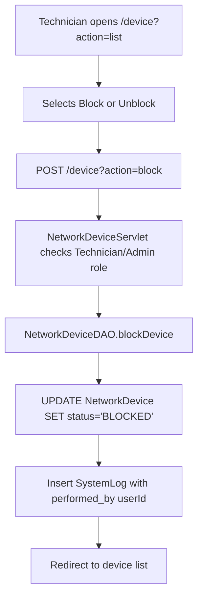
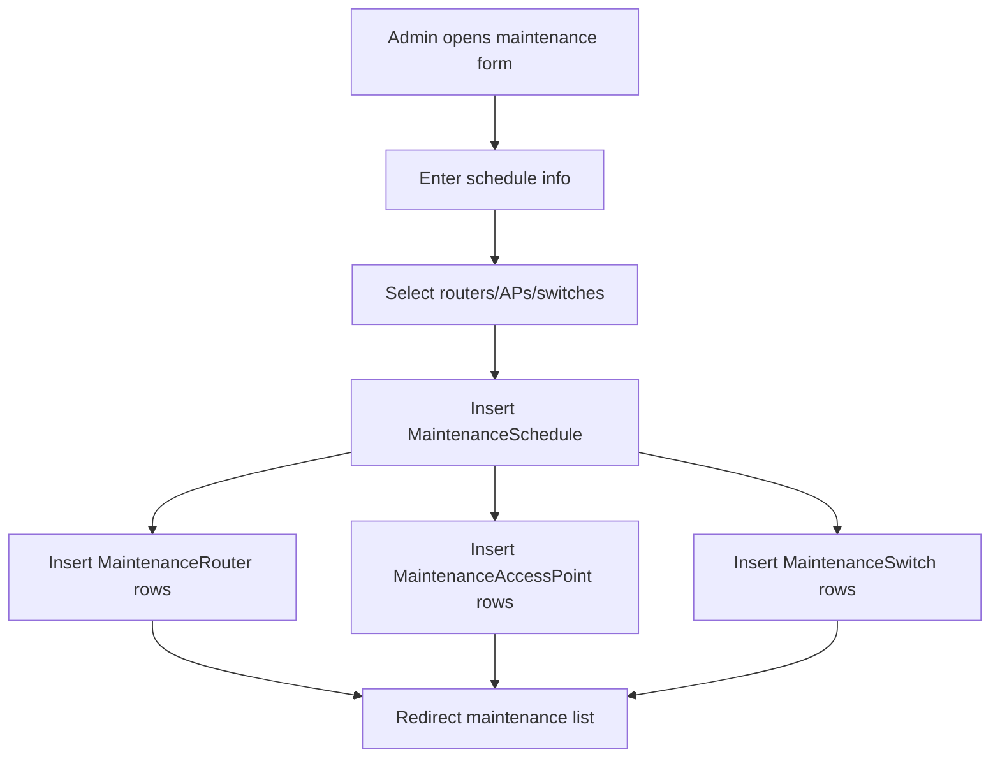
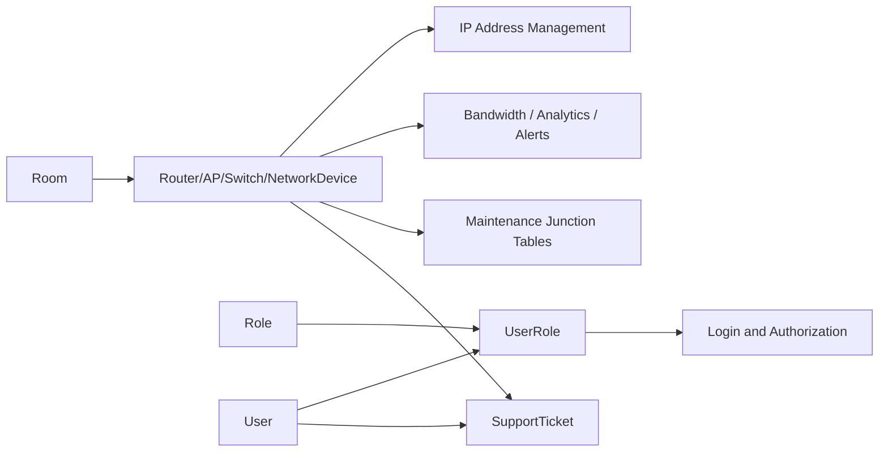

---
title: "Feature List by Role"
tags: [prj301, planning, features, roles]
created: 2026-05-26
updated: 2026-06-07
---

# Feature List by Role

This document is synchronized with `Network2.sql`. The current role model is:

```text
User --< UserRole >-- Role
```

Do not add a `role` field to `User`. Login and permission checks must use `UserRole`.

---

## 1. Role Definitions

| Role | Access Level | Description |
|---|---|---|
| Admin | Full access | Manage users, roles, devices, infrastructure, monitoring, tickets, maintenance, logs |
| Technician | Limited write | Maintain devices, block/unblock devices, resolve tickets, view alerts and analytics |
| Viewer | Read mostly | View status, submit tickets, view own tickets and maintenance schedule |

---

## 2. Features by Role

### 2.1 Admin Features

| # | Feature | Description | Models Touched | Owner |
|---|---|---|---|---|
| A1 | Login / Logout | Authenticate, write login result to auth log, store user and roles in session | User, UserRole, Role, AuthenticationLog | Member A |
| A2 | User Management | CRUD users, change password, activate/deactivate | User | Member A |
| A3 | Role Management | CRUD roles and assign/remove user roles | Role, UserRole, User | Member A |
| A4 | Router Management | Add/edit/delete routers, update status, assign room | Router, Room | Member B |
| A5 | Access Point Management | Add/edit/delete APs, update SSID, assign room | AccessPoint, Room | Member B |
| A6 | Switch Management | Add/edit/delete switches, update port usage, assign room | Switch, Room | Member B |
| A7 | Network Device Management | Add/edit/delete devices, block/unblock by MAC, assign room | NetworkDevice, Room | Member B |
| A8 | Room Management | Add/edit/delete rooms | Room | Member C |
| A9 | VLAN Management | Add/edit/delete VLANs, assign room when applicable | VLAN, Room | Member C |
| A10 | IP Address Management | Assign/release IPs to devices, view available IPs | IPAddressManagement, NetworkDevice | Member C |
| A11 | Support Ticket Management | View all tickets, update status, filter by user/device | SupportTicket, User, NetworkDevice | Member C |
| A12 | Bandwidth Monitoring | View bandwidth records, add manual entries, filter by device | BandwidthUsage, NetworkDevice | Member D |
| A13 | WiFi Analytics Dashboard | View daily/monthly analytics by access point | WiFiAnalytics, AccessPoint | Member D |
| A14 | Network Alerts | View alerts, filter by severity/device | NetworkAlert, Router, AccessPoint, Switch | Member D |
| A15 | Maintenance Scheduling | Create/edit/delete maintenance windows and link devices | MaintenanceSchedule, MaintenanceRouter, MaintenanceAccessPoint, MaintenanceSwitch | Member D |
| A16 | System Log Viewer | View all system actions, filter by date/user | SystemLog, User | Member A |
| A17 | Auth Log Viewer | View login attempts, filter failed logins/user | AuthenticationLog, User | Member A |

### 2.2 Technician Features

| # | Feature | Description | Models Touched | Owner |
|---|---|---|---|---|
| T1 | Login / Logout | Same login flow as Admin | User, UserRole, AuthenticationLog | Member A |
| T2 | View Routers | View router list, status, room | Router, Room | Member B |
| T3 | Update Router Status | Mark router as `ONLINE`, `OFFLINE`, or `MAINTENANCE` | Router | Member B |
| T4 | View Access Points | View AP list, connected users, room | AccessPoint, Room | Member B |
| T5 | View Switches | View switch list and port usage | Switch, Room | Member B |
| T6 | View Network Devices | View device list and room | NetworkDevice, Room | Member B |
| T7 | Block/Unblock Devices | Update device status to `BLOCKED` or `ALLOWED` | NetworkDevice, SystemLog | Member B |
| T8 | View Rooms | View room list | Room | Member C |
| T9 | View IP Addresses | View allocation status and assigned device | IPAddressManagement, NetworkDevice | Member C |
| T10 | Resolve Tickets | Update ticket status to `IN_PROGRESS` or `RESOLVED` | SupportTicket, SystemLog | Member C |
| T11 | View Bandwidth | View bandwidth usage by device/date | BandwidthUsage, NetworkDevice | Member D |
| T12 | View WiFi Analytics | View analytics dashboard by AP | WiFiAnalytics, AccessPoint | Member D |
| T13 | View Alerts | View and filter alerts by severity/device | NetworkAlert | Member D |
| T14 | View Maintenance Schedule | View upcoming maintenance and related devices | MaintenanceSchedule, MaintenanceRouter, MaintenanceAccessPoint, MaintenanceSwitch | Member D |

### 2.3 Viewer Features

| # | Feature | Description | Models Touched | Owner |
|---|---|---|---|---|
| V1 | Login / Logout | Same login flow as Admin | User, UserRole, AuthenticationLog | Member A |
| V2 | Submit Support Ticket | Create a new issue report as current user | SupportTicket, User, NetworkDevice | Member C |
| V3 | View My Tickets | See tickets where `created_by = current userId` | SupportTicket | Member C |
| V4 | View Network Status | See router/AP/switch online status | Router, AccessPoint, Switch | Member B |
| V5 | View Maintenance Schedule | See upcoming maintenance windows | MaintenanceSchedule | Member D |
| V6 | View Alerts Read-Only | See current alerts and severity | NetworkAlert | Member D |

---

## 3. Features That Need Schema Awareness

| Feature | Important schema rule |
|---|---|
| Role-based access | Use `UserRole`, not `User.role` |
| Ticket creation | `created_by` is an `INT` FK to `[User](user_id)` |
| Ticket assignment | Current schema has no `assigned_to`; implement only status update unless schema is extended |
| Alert resolving | Current schema has no alert status/resolved fields; implement filter/view only unless schema is extended |
| IP assignment | `IPAddressManagement.device_id` is nullable and unique |
| Device location | `Router`, `AccessPoint`, `Switch`, `NetworkDevice`, and `VLAN` can reference `Room` |
| Maintenance | Use junction tables to link one schedule to many routers/APs/switches |

---

## 4. Feature Map Diagram



---

## 5. User Journey: Top Features

### 5.1 Login and Role-Based Redirect



### 5.2 Device Block/Unblock



### 5.3 Maintenance Scheduling



---

## 6. Feature Dependencies



> Implement login and `UserRoleDAO` early. Role checks appear in almost every servlet.

---

## 7. Related Documents

- `Network2.sql` - Current SQL Server schema
- `03_team_assignment_updated.md` - Current team ownership
- `04_system_architecture.md` - Folder structure and utilities
- `07_coding_guide.md` - Implementation guide
