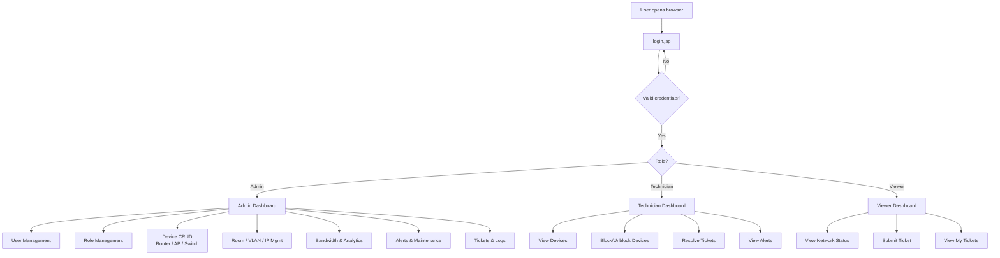
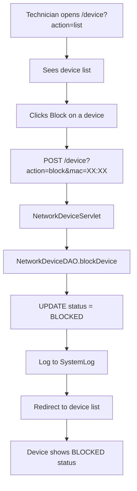
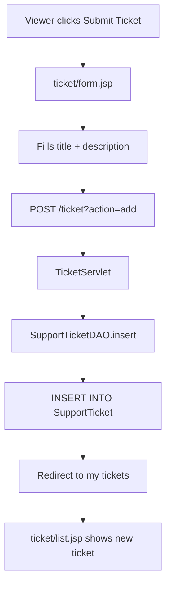
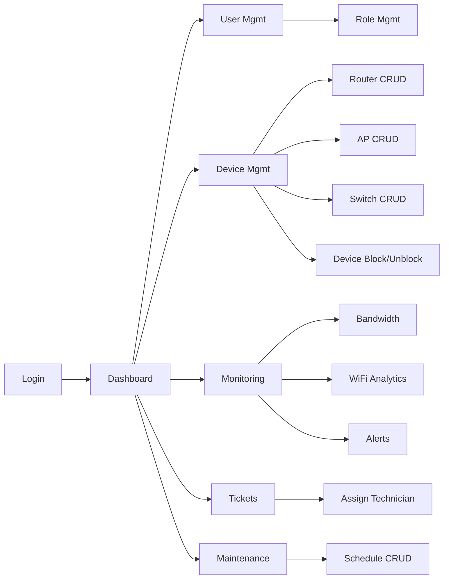

# Feature List by Role

## 1. Role Definitions

| Role | Access Level | Description |
|---|---|---|
| **Admin** | Full access | Manage users, roles, all devices, view all logs, configure system |
| **Technician** | Limited write | Maintain devices, resolve tickets, view alerts and analytics |
| **Viewer** | Read-only | View dashboards, submit tickets, view reports |

---

## 2. Features by Role

### 2.1 Admin Features

| # | Feature | Description | Models Touched | Owner |
|---|---|---|---|---|
| A1 | Login / Logout | Authenticate and create session | User, AuthenticationLog | Member A |
| A2 | User Management | CRUD users, change password, activate/deactivate | User | Member A |
| A3 | Role Management | Create/edit roles, assign roles to users | Role | Member A |
| A4 | Router Management | Add/edit/delete routers, update status, restart | Router | Member B |
| A5 | Access Point Management | Add/edit/delete APs, update SSID | AccessPoint | Member B |
| A6 | Switch Management | Add/edit/delete switches, update port usage | Switch | Member B |
| A7 | Network Device Management | Add/edit/delete devices, block/unblock by MAC | NetworkDevice | Member B |
| A8 | Room Management | Add/edit/delete rooms | Room | Member C |
| A9 | VLAN Management | Add/edit/delete VLANs | VLAN | Member C |
| A10 | IP Address Management | Assign/release IPs, view available IPs | IPAddressManagement | Member C |
| A11 | Support Ticket Management | View all tickets, assign technicians, close tickets | SupportTicket | Member C |
| A12 | Bandwidth Monitoring | View bandwidth records, add manual entries | BandwidthUsage | Member D |
| A13 | WiFi Analytics Dashboard | View daily/monthly analytics, generate reports | WiFiAnalytics | Member D |
| A14 | Network Alerts | View all alerts, resolve alerts | NetworkAlert | Member D |
| A15 | Maintenance Scheduling | Create/edit/delete maintenance windows | MaintenanceSchedule | Member D |
| A16 | System Log Viewer | View all system actions, filter by date/user | SystemLog | Member A |
| A17 | Auth Log Viewer | View login attempts, filter failed logins | AuthenticationLog | Member A |

### 2.2 Technician Features

| # | Feature | Description | Models Touched | Owner |
|---|---|---|---|---|
| T1 | Login / Logout | Same as Admin | User, AuthenticationLog | Member A |
| T2 | View Routers | View router list and status | Router | Member B |
| T3 | Update Router Status | Mark router as online/offline/maintenance | Router | Member B |
| T4 | View Access Points | View AP list, connected users | AccessPoint | Member B |
| T5 | View Switches | View switch list, port usage | Switch | Member B |
| T6 | View Network Devices | View device list | NetworkDevice | Member B |
| T7 | Block/Unblock Devices | Block or unblock student devices | NetworkDevice | Member B |
| T8 | View Rooms | View room list | Room | Member C |
| T9 | View IP Addresses | View IP allocation status | IPAddressManagement | Member C |
| T10 | Resolve Tickets | Update ticket status, add resolution notes | SupportTicket | Member C |
| T11 | View Bandwidth | View bandwidth usage records | BandwidthUsage | Member D |
| T12 | View WiFi Analytics | View analytics dashboard | WiFiAnalytics | Member D |
| T13 | View/Resolve Alerts | View alerts, mark as resolved | NetworkAlert | Member D |
| T14 | View Maintenance Schedule | View upcoming maintenance | MaintenanceSchedule | Member D |

### 2.3 Viewer Features

| # | Feature | Description | Models Touched | Owner |
|---|---|---|---|---|
| V1 | Login / Logout | Same as Admin | User, AuthenticationLog | Member A |
| V2 | Submit Support Ticket | Create a new WiFi issue report | SupportTicket | Member C |
| V3 | View My Tickets | See own ticket status | SupportTicket | Member C |
| V4 | View Network Status | See which routers/APs are online | Router, AccessPoint | Member B |
| V5 | View Maintenance Schedule | See upcoming maintenance windows | MaintenanceSchedule | Member D |
| V6 | View Alerts (read-only) | See current alerts | NetworkAlert | Member D |

---

## 3. Feature Map Diagram



---

## 4. User Journey: Top 3 Features

### 4.1 Login & Role-Based Redirect

```mermaid
flowchart TD
    A[Open login.jsp] --> B[Enter username + password]
    B --> C[POST /login]
    C --> D[LoginServlet validates]
    D --> E{Valid?}
    E -->|No| F[Show error on login.jsp]
    E -->|Yes| G[Create session]
    G --> H{Check role}
    H -->|Admin| I[/dashboard.jsp?role=admin]
    H -->|Technician| J[/dashboard.jsp?role=technician]
    H -->|Viewer| K[/dashboard.jsp?role=viewer]
```

### 4.2 Device Block/Unblock (Technician)



### 4.3 Submit Support Ticket (Viewer)



---

## 5. Feature Dependencies



> [!important]
> **Login must be implemented first.** All other features depend on session-based authentication.

---

## 6. Related Documents

- [[03_team_assignment]] — Who owns which features
- [[01_CT_analysis]] — Algorithm design for key features
- [[07_coding_guide]] — How to implement a feature end-to-end
