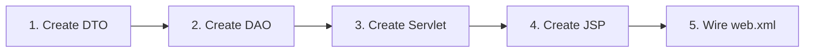

# Coding Guide: Implement One Model End-to-End

This guide walks you through implementing **one complete model** (Router) from DTO to JSP. Follow the same pattern for all 16 models.

---

## Overview: The 5 Steps



| Step | File | Package/Folder |
|---|---|---|
| 1 | `Router.java` | `com.networksim.model` |
| 2 | `RouterDAO.java` | `com.networksim.dao` |
| 3 | `RouterServlet.java` | `com.networksim.controller` |
| 4 | `router/list.jsp`, `router/form.jsp` | `Web Pages/router/` |
| 5 | `web.xml` | `Web Pages/WEB-INF/` |

---

## Step 1: Create the DTO (Model)

**File:** `com/networksim/model/Router.java`

```java
package com.networksim.model;

/**
 * DTO for Router table.
 * Fields match the database columns exactly.
 */
public class Router {

    // --- Fields ---
    private int routerId;
    private String routerName;
    private String ipAddress;
    private String macAddress;
    private String model;
    private String firmware;
    private String status;
    private String location;

    // --- Constructors ---
    public Router() {
    }

    public Router(int routerId, String routerName, String ipAddress,
                  String macAddress, String model, String firmware,
                  String status, String location) {
        this.routerId = routerId;
        this.routerName = routerName;
        this.ipAddress = ipAddress;
        this.macAddress = macAddress;
        this.model = model;
        this.firmware = firmware;
        this.status = status;
        this.location = location;
    }

    // --- Getters and Setters ---
    public int getRouterId() {
        return routerId;
    }

    public void setRouterId(int routerId) {
        this.routerId = routerId;
    }

    public String getRouterName() {
        return routerName;
    }

    public void setRouterName(String routerName) {
        this.routerName = routerName;
    }

    public String getIpAddress() {
        return ipAddress;
    }

    public void setIpAddress(String ipAddress) {
        this.ipAddress = ipAddress;
    }

    public String getMacAddress() {
        return macAddress;
    }

    public void setMacAddress(String macAddress) {
        this.macAddress = macAddress;
    }

    public String getModel() {
        return model;
    }

    public void setModel(String model) {
        this.model = model;
    }

    public String getFirmware() {
        return firmware;
    }

    public void setFirmware(String firmware) {
        this.firmware = firmware;
    }

    public String getStatus() {
        return status;
    }

    public void setStatus(String status) {
        this.status = status;
    }

    public String getLocation() {
        return location;
    }

    public void setLocation(String location) {
        this.location = location;
    }
}
```

> [!tip]
> The DTO has **no logic** — just fields, a no-arg constructor, a full constructor, and getters/setters. This is the "data carrier" pattern.

---

## Step 2: Create the DAO

**File:** `com/networksim/dao/RouterDAO.java`

```java
package com.networksim.dao;

import com.networksim.model.Router;
import com.networksim.util.DBContext;
import java.sql.*;
import java.util.ArrayList;
import java.util.List;

/**
 * Data Access Object for Router table.
 * All SQL goes here — never in Servlet or JSP.
 */
public class RouterDAO {

    /**
     * Insert a new router into the database.
     * @param r Router object with data to insert
     * @return true if insert succeeded
     */
    public boolean insert(Router r) {
        String sql = "INSERT INTO Router (router_name, ip_address, mac_address, model, firmware, status, location) "
                   + "VALUES (?, ?, ?, ?, ?, ?, ?)";
        try (Connection conn = DBContext.getConnection();
             PreparedStatement ps = conn.prepareStatement(sql)) {

            ps.setString(1, r.getRouterName());
            ps.setString(2, r.getIpAddress());
            ps.setString(3, r.getMacAddress());
            ps.setString(4, r.getModel());
            ps.setString(5, r.getFirmware());
            ps.setString(6, r.getStatus());
            ps.setString(7, r.getLocation());

            return ps.executeUpdate() > 0;

        } catch (Exception e) {
            e.printStackTrace();
            return false;
        }
    }

    /**
     * Update an existing router.
     * @param r Router object with updated data
     * @return true if update succeeded
     */
    public boolean update(Router r) {
        String sql = "UPDATE Router SET router_name=?, ip_address=?, mac_address=?, "
                   + "model=?, firmware=?, status=?, location=? WHERE router_id=?";
        try (Connection conn = DBContext.getConnection();
             PreparedStatement ps = conn.prepareStatement(sql)) {

            ps.setString(1, r.getRouterName());
            ps.setString(2, r.getIpAddress());
            ps.setString(3, r.getMacAddress());
            ps.setString(4, r.getModel());
            ps.setString(5, r.getFirmware());
            ps.setString(6, r.getStatus());
            ps.setString(7, r.getLocation());
            ps.setInt(8, r.getRouterId());

            return ps.executeUpdate() > 0;

        } catch (Exception e) {
            e.printStackTrace();
            return false;
        }
    }

    /**
     * Delete a router by ID.
     * @param id Router ID to delete
     * @return true if delete succeeded
     */
    public boolean delete(int id) {
        String sql = "DELETE FROM Router WHERE router_id=?";
        try (Connection conn = DBContext.getConnection();
             PreparedStatement ps = conn.prepareStatement(sql)) {

            ps.setInt(1, id);
            return ps.executeUpdate() > 0;

        } catch (Exception e) {
            e.printStackTrace();
            return false;
        }
    }

    /**
     * Find a router by ID.
     * @param id Router ID
     * @return Router object, or null if not found
     */
    public Router findById(int id) {
        String sql = "SELECT * FROM Router WHERE router_id=?";
        try (Connection conn = DBContext.getConnection();
             PreparedStatement ps = conn.prepareStatement(sql)) {

            ps.setInt(1, id);
            ResultSet rs = ps.executeQuery();

            if (rs.next()) {
                return mapRow(rs);
            }

        } catch (Exception e) {
            e.printStackTrace();
        }
        return null;
    }

    /**
     * Get all routers.
     * @return List of all Router objects
     */
    public List<Router> findAll() {
        List<Router> list = new ArrayList<>();
        String sql = "SELECT * FROM Router ORDER BY router_id";
        try (Connection conn = DBContext.getConnection();
             PreparedStatement ps = conn.prepareStatement(sql);
             ResultSet rs = ps.executeQuery()) {

            while (rs.next()) {
                list.add(mapRow(rs));
            }

        } catch (Exception e) {
            e.printStackTrace();
        }
        return list;
    }

    /**
     * Update only the status of a router.
     * @param id Router ID
     * @param status New status value
     * @return true if update succeeded
     */
    public boolean updateStatus(int id, String status) {
        String sql = "UPDATE Router SET status=? WHERE router_id=?";
        try (Connection conn = DBContext.getConnection();
             PreparedStatement ps = conn.prepareStatement(sql)) {

            ps.setString(1, status);
            ps.setInt(2, id);
            return ps.executeUpdate() > 0;

        } catch (Exception e) {
            e.printStackTrace();
            return false;
        }
    }

    /**
     * Map a ResultSet row to a Router object.
     * Private helper to avoid code duplication.
     */
    private Router mapRow(ResultSet rs) throws SQLException {
        Router r = new Router();
        r.setRouterId(rs.getInt("router_id"));
        r.setRouterName(rs.getString("router_name"));
        r.setIpAddress(rs.getString("ip_address"));
        r.setMacAddress(rs.getString("mac_address"));
        r.setModel(rs.getString("model"));
        r.setFirmware(rs.getString("firmware"));
        r.setStatus(rs.getString("status"));
        r.setLocation(rs.getString("location"));
        return r;
    }
}
```

### DAO Pattern Notes

| Concept | How Applied |
|---|---|
| **PreparedStatement** | Prevents SQL injection — always use `?` placeholders |
| **try-with-resources** | Auto-closes Connection, PreparedStatement, ResultSet |
| **mapRow() helper** | Avoids repeating column-to-field mapping in every method |
| **Return boolean** | `insert/update/delete` return success/failure |
| **Return object/list** | `findById/findAll` return data |
| **Return null** | `findById` returns null when not found |

---

## Step 3: Create the Servlet

**File:** `com/networksim/controller/RouterServlet.java`

```java
package com.networksim.controller;

import com.networksim.dao.RouterDAO;
import com.networksim.model.Router;
import com.networksim.model.User;
import com.networksim.util.SessionUtil;

import java.io.IOException;
import java.util.List;
import javax.servlet.ServletException;
import javax.servlet.annotation.WebServlet;
import javax.servlet.http.*;

/**
 * Controller for Router CRUD operations.
 * URL: /router
 * Actions: list, add, edit, delete, updateStatus
 */
@WebServlet(name = "RouterServlet", urlPatterns = {"/router"})
public class RouterServlet extends HttpServlet {

    private RouterDAO routerDAO = new RouterDAO();

    @Override
    protected void doGet(HttpServletRequest request, HttpServletResponse response)
            throws ServletException, IOException {

        // Check login
        User loggedUser = SessionUtil.getLoggedUser(request);
        if (loggedUser == null) {
            response.sendRedirect("login");
            return;
        }

        String action = request.getParameter("action");
        if (action == null) action = "list";

        switch (action) {
            case "list":
                listRouters(request, response);
                break;
            case "add":
                showAddForm(request, response);
                break;
            case "edit":
                showEditForm(request, response);
                break;
            case "delete":
                deleteRouter(request, response, loggedUser);
                break;
            default:
                listRouters(request, response);
        }
    }

    @Override
    protected void doPost(HttpServletRequest request, HttpServletResponse response)
            throws ServletException, IOException {

        // Check login
        User loggedUser = SessionUtil.getLoggedUser(request);
        if (loggedUser == null) {
            response.sendRedirect("login");
            return;
        }

        // Set encoding for Vietnamese characters
        request.setCharacterEncoding("UTF-8");

        String action = request.getParameter("action");
        if (action == null) action = "";

        switch (action) {
            case "add":
                addRouter(request, response, loggedUser);
                break;
            case "edit":
                editRouter(request, response, loggedUser);
                break;
            default:
                listRouters(request, response);
        }
    }

    // --- Action Methods ---

    private void listRouters(HttpServletRequest request, HttpServletResponse response)
            throws ServletException, IOException {
        List<Router> list = routerDAO.findAll();
        request.setAttribute("routerList", list);
        request.getRequestDispatcher("router/list.jsp").forward(request, response);
    }

    private void showAddForm(HttpServletRequest request, HttpServletResponse response)
            throws ServletException, IOException {
        request.getRequestDispatcher("router/form.jsp").forward(request, response);
    }

    private void showEditForm(HttpServletRequest request, HttpServletResponse response)
            throws ServletException, IOException {
        int id = Integer.parseInt(request.getParameter("id"));
        Router router = routerDAO.findById(id);
        request.setAttribute("router", router);
        request.getRequestDispatcher("router/form.jsp").forward(request, response);
    }

    private void addRouter(HttpServletRequest request, HttpServletResponse response, User user)
            throws IOException {
        Router r = extractRouterFromForm(request);
        r.setStatus("ONLINE");

        if (routerDAO.insert(r)) {
            response.sendRedirect("router?action=list&msg=added");
        } else {
            response.sendRedirect("router?action=list&msg=error");
        }
    }

    private void editRouter(HttpServletRequest request, HttpServletResponse response, User user)
            throws IOException {
        Router r = extractRouterFromForm(request);
        r.setRouterId(Integer.parseInt(request.getParameter("routerId")));

        if (routerDAO.update(r)) {
            response.sendRedirect("router?action=list&msg=updated");
        } else {
            response.sendRedirect("router?action=list&msg=error");
        }
    }

    private void deleteRouter(HttpServletRequest request, HttpServletResponse response, User user)
            throws IOException {
        // Only Admin can delete
        if (!"Admin".equals(user.getRole())) {
            response.sendRedirect("router?action=list&msg=access_denied");
            return;
        }

        int id = Integer.parseInt(request.getParameter("id"));
        if (routerDAO.delete(id)) {
            response.sendRedirect("router?action=list&msg=deleted");
        } else {
            response.sendRedirect("router?action=list&msg=error");
        }
    }

    // --- Helper ---

    private Router extractRouterFromForm(HttpServletRequest request) {
        Router r = new Router();
        r.setRouterName(request.getParameter("routerName"));
        r.setIpAddress(request.getParameter("ipAddress"));
        r.setMacAddress(request.getParameter("macAddress"));
        r.setModel(request.getParameter("model"));
        r.setFirmware(request.getParameter("firmware"));
        r.setStatus(request.getParameter("status"));
        r.setLocation(request.getParameter("location"));
        return r;
    }
}
```

### Servlet Pattern Notes

| Concept | How Applied |
|---|---|
| `@WebServlet` | Maps URL `/router` — no web.xml entry needed |
| `doGet` handles display | list, add form, edit form, delete |
| `doPost` handles mutation | add, edit |
| `request.setCharacterEncoding("UTF-8")` | Supports Vietnamese input |
| `SessionUtil.getLoggedUser` | Checks login before any action |
| Role check before delete | Only Admin can delete |
| `response.sendRedirect` | PRG pattern (Post-Redirect-Get) prevents duplicate submissions |
| `extractRouterFromForm` | Helper to avoid repeating parameter extraction |

---

## Step 4: Create the JSP Pages

### 4.1 List Page

**File:** `Web Pages/router/list.jsp`

```jsp
<%@page contentType="text/html" pageEncoding="UTF-8"%>
<%@page import="java.util.List"%>
<%@page import="com.networksim.model.Router"%>
<%@page import="com.networksim.model.User"%>
<!DOCTYPE html>
<html>
<head>
    <meta charset="UTF-8">
    <title>Router Management</title>
    <link rel="stylesheet" href="assets/css/style.css">
</head>
<body>
<%
    User loggedUser = (User) session.getAttribute("loggedUser");
    if (loggedUser == null) {
        response.sendRedirect("login");
        return;
    }
    List<Router> routerList = (List<Router>) request.getAttribute("routerList");
%>

<div class="container">
    <h1>Router Management</h1>

    <!-- Navigation -->
    <nav>
        <a href="dashboard">Dashboard</a> |
        <a href="router?action=list" class="active">Routers</a> |
        <a href="accesspoint?action=list">Access Points</a> |
        <a href="switch?action=list">Switches</a> |
        <a href="device?action=list">Devices</a>
        <% if ("Admin".equals(loggedUser.getRole())) { %>
            | <a href="user?action=list">Users</a>
        <% } %>
        | <a href="login?action=logout">Logout</a>
    </nav>

    <!-- Success/Error Messages -->
    <% String msg = request.getParameter("msg"); %>
    <% if ("added".equals(msg)) { %>
        <p class="success">Router added successfully!</p>
    <% } else if ("updated".equals(msg)) { %>
        <p class="success">Router updated successfully!</p>
    <% } else if ("deleted".equals(msg)) { %>
        <p class="success">Router deleted successfully!</p>
    <% } else if ("error".equals(msg)) { %>
        <p class="error">An error occurred. Please try again.</p>
    <% } %>

    <!-- Add Button (Admin only) -->
    <% if ("Admin".equals(loggedUser.getRole())) { %>
        <p><a href="router?action=add" class="btn">+ Add New Router</a></p>
    <% } %>

    <!-- Router Table -->
    <table border="1" cellpadding="8" cellspacing="0">
        <thead>
            <tr>
                <th>ID</th>
                <th>Name</th>
                <th>IP Address</th>
                <th>MAC Address</th>
                <th>Model</th>
                <th>Status</th>
                <th>Location</th>
                <th>Actions</th>
            </tr>
        </thead>
        <tbody>
        <% if (routerList != null) {
            for (Router r : routerList) { %>
            <tr>
                <td><%= r.getRouterId() %></td>
                <td><%= r.getRouterName() %></td>
                <td><%= r.getIpAddress() %></td>
                <td><%= r.getMacAddress() %></td>
                <td><%= r.getModel() %></td>
                <td class="status-<%= r.getStatus().toLowerCase() %>"><%= r.getStatus() %></td>
                <td><%= r.getLocation() %></td>
                <td>
                    <% if ("Admin".equals(loggedUser.getRole())) { %>
                        <a href="router?action=edit&id=<%= r.getRouterId() %>">Edit</a> |
                        <a href="router?action=delete&id=<%= r.getRouterId() %>"
                           onclick="return confirm('Delete this router?')">Delete</a>
                    <% } else { %>
                        <a href="router?action=edit&id=<%= r.getRouterId() %>">View</a>
                    <% } %>
                </td>
            </tr>
        <%  }
           } %>
        </tbody>
    </table>
</div>
</body>
</html>
```

### 4.2 Form Page (Add/Edit)

**File:** `Web Pages/router/form.jsp`

```jsp
<%@page contentType="text/html" pageEncoding="UTF-8"%>
<%@page import="com.networksim.model.Router"%>
<%@page import="com.networksim.model.User"%>
<!DOCTYPE html>
<html>
<head>
    <meta charset="UTF-8">
    <title>Router Form</title>
    <link rel="stylesheet" href="assets/css/style.css">
</head>
<body>
<%
    User loggedUser = (User) session.getAttribute("loggedUser");
    if (loggedUser == null) {
        response.sendRedirect("login");
        return;
    }
    Router router = (Router) request.getAttribute("router");
    boolean isEdit = (router != null);
%>

<div class="container">
    <h1><%= isEdit ? "Edit Router" : "Add New Router" %></h1>

    <nav>
        <a href="dashboard">Dashboard</a> |
        <a href="router?action=list">Back to List</a>
    </nav>

    <form action="router" method="post">
        <input type="hidden" name="action" value="<%= isEdit ? "edit" : "add" %>">
        <% if (isEdit) { %>
            <input type="hidden" name="routerId" value="<%= router.getRouterId() %>">
        <% } %>

        <table>
            <tr>
                <td>Router Name:</td>
                <td><input type="text" name="routerName"
                    value="<%= isEdit ? router.getRouterName() : "" %>" required></td>
            </tr>
            <tr>
                <td>IP Address:</td>
                <td><input type="text" name="ipAddress"
                    value="<%= isEdit ? router.getIpAddress() : "" %>" required></td>
            </tr>
            <tr>
                <td>MAC Address:</td>
                <td><input type="text" name="macAddress"
                    value="<%= isEdit ? router.getMacAddress() : "" %>"></td>
            </tr>
            <tr>
                <td>Model:</td>
                <td><input type="text" name="model"
                    value="<%= isEdit ? router.getModel() : "" %>"></td>
            </tr>
            <tr>
                <td>Firmware:</td>
                <td><input type="text" name="firmware"
                    value="<%= isEdit ? router.getFirmware() : "" %>"></td>
            </tr>
            <tr>
                <td>Status:</td>
                <td>
                    <select name="status">
                        <option value="ONLINE" <%= isEdit && "ONLINE".equals(router.getStatus()) ? "selected" : "" %>>ONLINE</option>
                        <option value="OFFLINE" <%= isEdit && "OFFLINE".equals(router.getStatus()) ? "selected" : "" %>>OFFLINE</option>
                        <option value="MAINTENANCE" <%= isEdit && "MAINTENANCE".equals(router.getStatus()) ? "selected" : "" %>>MAINTENANCE</option>
                    </select>
                </td>
            </tr>
            <tr>
                <td>Location:</td>
                <td><input type="text" name="location"
                    value="<%= isEdit ? router.getLocation() : "" %>"></td>
            </tr>
            <tr>
                <td></td>
                <td>
                    <button type="submit"><%= isEdit ? "Update" : "Add" %> Router</button>
                    <a href="router?action=list">Cancel</a>
                </td>
            </tr>
        </table>
    </form>
</div>
</body>
</html>
```

---

## Step 5: Wire Up web.xml (Optional)

If you use `@WebServlet("/router")` (as shown above), you **do not** need to add anything to `web.xml`. The annotation handles the mapping.

However, if you prefer XML-based mapping, add this to `web.xml`:

```xml
<servlet>
    <servlet-name>RouterServlet</servlet-name>
    <servlet-class>com.networksim.controller.RouterServlet</servlet-class>
</servlet>
<servlet-mapping>
    <servlet-name>RouterServlet</servlet-name>
    <url-pattern>/router</url-pattern>
</servlet-mapping>
```

> [!tip]
> Use `@WebServlet` annotations — they're cleaner and easier to maintain. Only use `web.xml` for filters and welcome files.

---

## Step 6: Test It

1. Build and deploy the project in NetBeans
2. Open `http://localhost:8080/NetworkSimulationManagement/router?action=list`
3. Test: Add a router → verify it appears in the list
4. Test: Edit a router → verify changes save
5. Test: Delete a router → verify it's removed
6. Test: Login as Viewer → verify Edit/Delete buttons are hidden

---

## Common Mistakes to Avoid

| Mistake | Why It's Bad | Fix |
|---|---|---|
| Closing Connection manually in try block | Resource leak if exception occurs | Use try-with-resources |
| Building SQL with string concatenation | SQL injection vulnerability | Always use PreparedStatement |
| Putting SQL in Servlet | Violates layer separation | All SQL goes in DAO |
| Forgetting `request.setCharacterEncoding("UTF-8")` | Vietnamese characters become garbled | Add it in every doPost |
| Not checking session in Servlet | Unauthorized access | Use `SessionUtil.getLoggedUser()` |
| Using `SELECT *` then hardcoding column names | Breaks if table schema changes | Use column aliases or `mapRow()` helper |
| Returning empty list instead of null | JSP may show blank page with no error | Return empty `ArrayList`, not null |
| Not using PRG pattern | Refreshing page re-submits the form | Always redirect after POST |

---

## Replicate This Pattern for Other Models

To implement any other model, follow the same 5 steps:

1. **DTO** — Create `Xxx.java` in `com.networksim.model` with fields matching DB columns
2. **DAO** — Create `XxxDAO.java` in `com.networksim.dao` with CRUD methods
3. **Servlet** — Create `XxxServlet.java` in `com.networksim.controller` with doGet/doPost
4. **JSP** — Create `xxx/list.jsp` and `xxx/form.jsp` in `Web Pages/xxx/`
5. **Test** — Run and verify all CRUD operations work

> [!note]
> Some models have special methods beyond CRUD:
> - `NetworkDeviceDAO.blockDevice()` / `unblockDevice()`
> - `SupportTicketDAO.assignTechnician()`
> - `WiFiAnalyticsDAO.generateDailyAnalytics()`
> - `BandwidthUsageDAO.findTopUsage()`
>
> Add these as additional methods in the DAO, and call them from the Servlet.

---

## Related Documents

- [[00_project_overview]] — Project overview
- [[02_erd_database]] — Database schema (use these column names!)
- [[03_team_assignment]] — Who implements which model
- [[04_system_architecture]] — Folder structure and naming conventions
